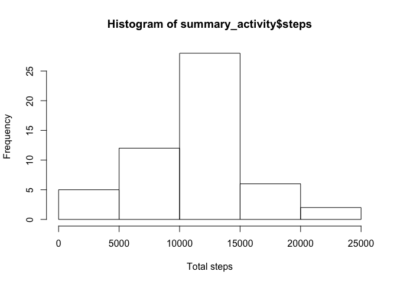
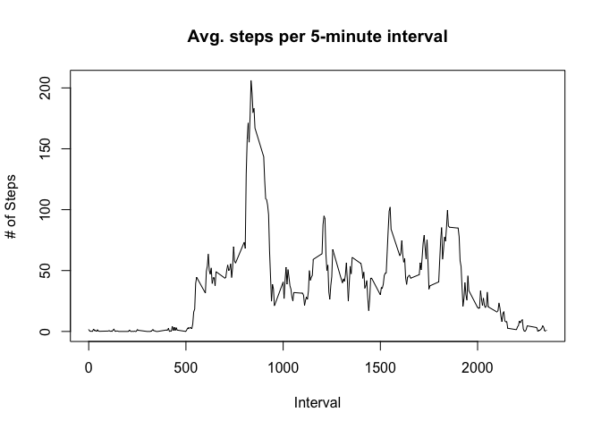
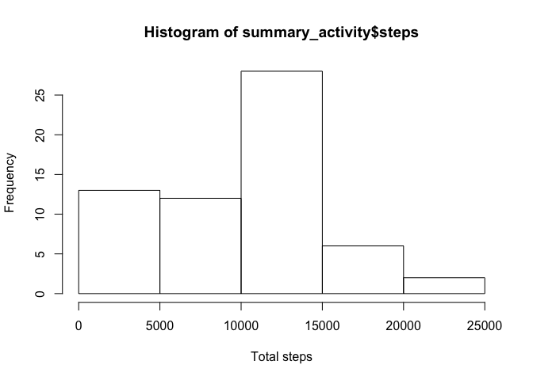
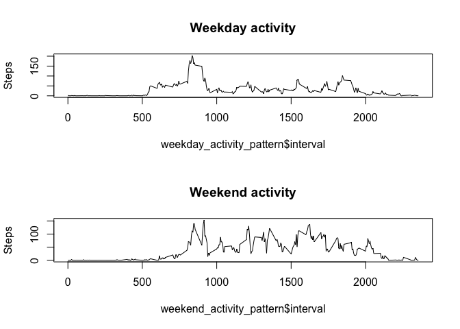

# Reproducible Research: Peer Assessment 1


## Loading and preprocessing the data

```r
activity <- read.csv("activity.csv")
```

## What is mean total number of steps taken per day?

```r
summary_activity <- aggregate(steps ~ date, data=activity, FUN=sum)
hist(as.numeric(summary_activity$steps), main="Histogram of summary_activity$steps", xlab="Total steps")
```

 

```r
paste("Total # of steps:", sum(summary_activity$steps))
```

```
## [1] "Total # of steps: 570608"
```

```r
paste("Mean steps:", mean(summary_activity$steps))
```

```
## [1] "Mean steps: 10766.1886792453"
```

```r
paste("Median steps: ", median(summary_activity$steps))
```

```
## [1] "Median steps:  10765"
```


## What is the average daily activity pattern?

```r
daily_activity_pattern <- aggregate(steps ~ interval, data=activity, FUN=mean)
plot(daily_activity_pattern$interval, daily_activity_pattern$steps, type="l", main="Avg. steps per 5-minute interval", xlab="Interval", ylab="# of Steps")
```

 

```r
# Interval with most activity across all days, on average
most_active_interval <- subset(daily_activity_pattern, daily_activity_pattern$steps == max(daily_activity_pattern$steps))
most_active_interval
```

```
##     interval    steps
## 104      835 206.1698
```

```r
paste("Interval with most activity: ", most_active_interval$interval)
```

```
## [1] "Interval with most activity:  835"
```

## Imputing missing values

```r
missing_intervals <- subset(activity, is.na(activity$steps))
# Number of intervals with missing steps
length(missing_intervals$steps)
```

```
## [1] 2304
```

```r
# Impute missing values
lookup_mean <- function(i) {
  interval <- filter(daily_activity_pattern, interval == 0) %>% select(steps)
  return(interval$steps)
}

# Replace missing steps with the mean from the daily_activity_pattern:
activity <- mutate(activity, steps = ifelse(is.na(steps), lookup_mean(interval), steps))

# Create a histogram of the total number of steps taken each day
summary_activity <- aggregate(steps ~ date, data=activity, FUN=sum)
hist(as.numeric(summary_activity$steps), main="Histogram of summary_activity$steps", xlab="Total steps")
```

 

```r
paste("Total # of steps:", sum(summary_activity$steps))
```

```
## [1] "Total # of steps: 574563.924528302"
```

```r
paste("Mean steps:", mean(summary_activity$steps))
```

```
## [1] "Mean steps: 9419.08072997216"
```

```r
paste("Median steps: ", median(summary_activity$steps))
```

```
## [1] "Median steps:  10395"
```

```r
# Do these values differ from the estimates from the first part of the assignment? 
# Answer: The Total number of steps is greater in this data set, as expected. In the data set with
# imputed values, the mean and median are both lower.
```

## Are there differences in activity patterns between weekdays and weekends?

```r
activity <- mutate(activity, 
                   weekday_factor = factor(ifelse(weekdays(as.Date(date)) %in% c("Monday", "Tuesday", "Wednesday", 
                                                                                 "Thursday", "Friday"), 
                                                  "weekday", "weekend"),
                                           levels=c("weekday", "weekend")));                  
weekday_activity <- activity %>% filter(weekday_factor=="weekday")
head(weekday_activity)
```

```
##      steps       date interval weekday_factor
## 1 1.716981 2012-10-01        0        weekday
## 2 1.716981 2012-10-01        5        weekday
## 3 1.716981 2012-10-01       10        weekday
## 4 1.716981 2012-10-01       15        weekday
## 5 1.716981 2012-10-01       20        weekday
## 6 1.716981 2012-10-01       25        weekday
```

```r
weekday_activity_pattern <- aggregate(steps ~ interval, data=weekday_activity, FUN=mean)

weekend_activity <- activity %>% filter(weekday_factor=="weekend")
weekend_activity_pattern <- aggregate(steps ~ interval, data=weekend_activity, FUN=mean)
par(mfrow=c(2,1))
plot(weekday_activity_pattern$interval, weekday_activity_pattern$steps, type="l", ylab="Steps", main="Weekday activity")
plot(weekend_activity_pattern$interval, weekend_activity_pattern$steps, type="l", ylab="Steps", main="Weekend activity")
```

 
